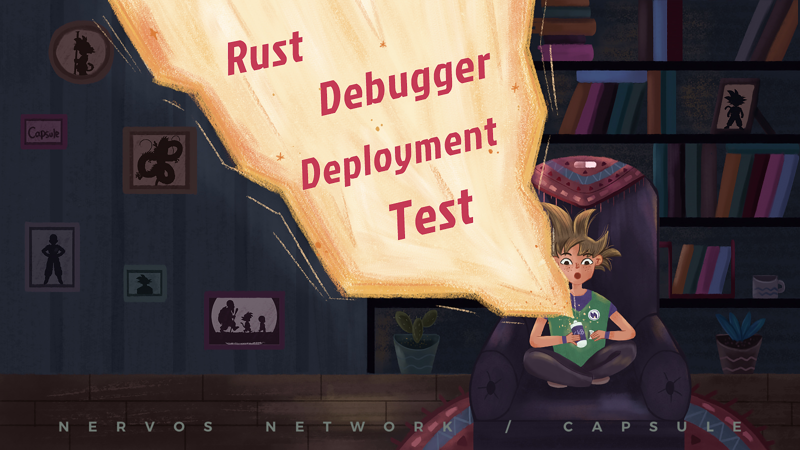

# Capsule



> Capsule is still under active development and considered to be a work in progress.

Capsule is a development framework for creating smart contract for Nervos' CKB layer 1 blockchain. Capsule is designed to provide an out-of-the-box solution that helps Nervos developers accomplish common tasks quickly and painlessly.

Capsule provides the following functionality:
- Scaffolding for new projects.
- Building of RISC-V binaries for Nervos CKB-VM.
- Local execution of smart contract scripts via Docker.
- Automated testing of smart contract scripts.
- Configurable deployment of scripts to Nervos CKB.
- Generation of simulated transaction data for debugging.

## Installation

### Supported Environments

- Linux
- macOS
- Windows (WSL2)

### Prerequisites

The following must be installed and available to use Capsule.

- Docker - Capsule uses `docker` to build contracts and run tests. https://docs.docker.com/get-docker/
- ckb-cli (optional) - Capsule requires `ckb-cli` to enable the smart contract deployment feature. https://github.com/nervosnetwork/ckb-cli/releases

Note: Docker and ckb-cli must be accessible in the `PATH` in order for them to be used by Capsule.

Note: The current user must have permission to manage Docker instances. [How to manage Docker as a non-root user.](https://docs.docker.com/engine/install/linux-postinstall/)

### Install binary

Install ckb-capsule from crates.io need Rust **1.51.0** or above.

[Download the latest release](https://github.com/nervosnetwork/capsule/releases/latest)

### Cargo install

Install the latest version

``` sh
cargo install ckb-capsule
```

Install the develop branch

``` sh
cargo install ckb-capsule --git https://github.com/nervosnetwork/capsule.git --branch develop
```

## Usage

```
USAGE:
capsule [SUBCOMMAND]

FLAGS:
    -h, --help       Prints help information
    -V, --version    Prints version information

SUBCOMMANDS:
    check           Check environment and dependencies
    new             Create a new project
    new-contract    Create a new contract
    build           Build contracts
    run             Run command in contract build image
    test            Run tests
    deploy          Deploy contracts, edit deployment.toml to custodian deployment recipe.
    debugger        CKB debugger
    help            Prints this message or the help of the given subcommand(s)
```

### Quick Start

``` sh
# check environment
capsule check

# create project
capsule new my-demo
cd my-demo
capsule build
capsule test
```

### Project Layout

* `capsule.toml`    - Capsule manifest file.
* `deployment.toml` - Deployment configuration.
* `contracts`       - Contracts directory.
* `tests`           - Contracts tests.
* `build`           - Contracts binaries.
* `migrations`      - Deployment histories.

## Documentation

[Capsule Wiki on GitHub](https://github.com/nervosnetwork/capsule/wiki)

## LICENSE

[MIT](https://github.com/nervosnetwork/capsule/blob/master/LICENSE)
